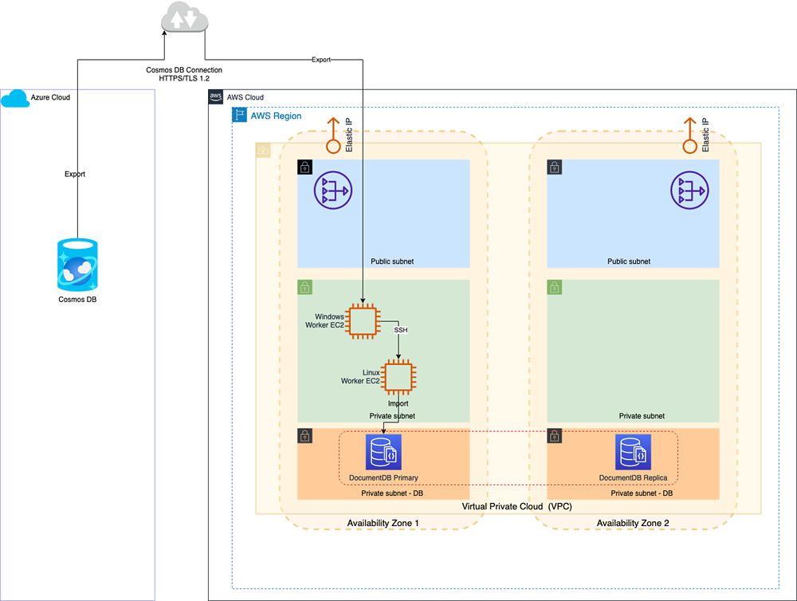

# Blog: Migrate Azure Cosmos DB SQL API to Amazon DocumentDB (with MongoDB Compatibility) using native tools and automation
by Igor Obradovic and Nicolas Ruiz

## Overview

This example shows you how to migrate Azure Cosmos DB SQL API to Amazon DocumentDB (with MongoDB Compatibility) using automation and native tools. 



Use the [IAM Policy](CF-User-Policy.json) to create an IAM role that will provision resources and run the migration process. The policy follows AWS IAM’s best practices and least privilege principle. This way we ensure that the user conducting the migration will not have excessive privileges, and thus we keep a high level of security that is compliant with most production workloads. First download the [user policy](CF-User-Policy.json) and save it to your computer locally, in the working directory where you will run the following AWS CLI commands: 

`$ aws iam create-policy --policy-name DBDocMigrationUserPolicy --policy-document file://CF-User-Policy.json`

Note the Policy ARN from the output of the previous step, and then proceed with the user creation commands (replace 12345678910 with your actual account number): 

```
$ aws iam create-role --role-name DBDocMigRole --assume-role-policy-document '{"Version": "2012-10-17", "Statement": [{"Effect": "Allow", "Principal": {"AWS": "12345678910"}, "Action": "sts:AssumeRole"}]}'
$ aws iam attach-role-policy --role-name DBDocMigRole --policy-arn arn:aws:iam::12345678910:policy/DBDocMigrationUserPolicy 

```

After you have created this role, create additional resources with AWS CloudFormation. Sign in to the AWS Management Console and then switch to the role you just created (DBDocMigRole). The [CloudFormation template](CosmosDB-Migration.yaml) will provision the stack with EC2 worker instances, IAM Role and Security Groups. Once the stack is provisioned, log in to the Windows EC2 worker instance using AWS Systems Manager Session Manager, and invoke the migration process: 

`C:\CosmosDB2JSON\CosmosDB2JSON.bat`
 
Observe the logs in Windows and Linux EC2 worker instances and verify that the migration of data from Cosmos DB to DocumentDB was successful. Log in to the Linux EC2 worker instance using AWS Systems Manager Session Manager, and watch the log: 

`tail -f /var/log/JSON2DocumentDB`

## Prerequisites

The migration process assumes that the Azure Cosmos DB account, database and collection already exist and are available. Equally, the assumption is that the target Amazon DocumentDB cluster is provisioned and available. The example collection that we use throughout the migration is called “us-zip-codes” and it was imported into the source Cosmos DB database from [https://media.mongodb.org/zips.json](https://media.mongodb.org/zips.json) 

Other prerequisites are as follows: 

1. The migration automation is deployed and executed in the existing AWS account, where the DocumentDB database cluster is running 
2.	The DocumentDB cluster has already been created prior to database migration. You need to obtain the following parameters related to your target DocumentDB cluster, before you begin with the migration: 

	* Cluster Endpoint (e.g. docdb-demo-dev-par-cluster.cluster-ck1z9gimxtxg.eu-west-3.docdb.amazonaws.com) 
	* Cluster Port (e.g. 27017) 
	* Database Name – the name of the database that will be imported (e.g. PostalService)
	* Collection Name – the name of the collection that will be imported (e.g. us-zip-codes)
	* Security group ID of the security group associated with the DocumentDB (e.g. sg-0b7ff7c3783633e54)
3.	We assume that the DocumentDB credentials are stored in AWS Secrets Manager. You need to provide these two parameters to the CloudFormation stack: 
	* Secret ARN of the DocumentDB Secret in the AWS Secrets Manager
	* Security group ID of the security group associated with the Secrets Manager (or its VPC Endpoint)
4.	VPC configuration: the assumption is that you have already created the VPC and partitioned it into private and public subnets. The migration EC2 worker instances are intended to be deployed in private subnets, to enhance security. Nevertheless, the EC2 instances in private subnets must have Internet access via NAT Gateway. Therefore, you must obtain the following parameters, before you begin with the migration: 
	* a.	VPC ID (e.g. vpc-0e8a0b6878701aa40) 
	* Subnet ID of the subnet where Windows and Linux EC2 worker instances will be provisioned. It should be the same subnet (e.g. subnet-009f34769ff72ae39)
5.	Have one created or create a new Key Pair and download the associated pem file. We will need this Key Pair when we provision the EC2 worker instances involved in the migration. Have the private key (pem format) of the EC2 Key Pair at hand, as it is one of the CloudFormation stack parameters.
6.	You have your Azure account, the source Cosmos DB database and collection available. These parameters need to be obtained and provided to the CloudFormation stack during the migration process: 
	* AccountEndpoint, URL and port (e.g. https://cosmos-db01.documents.azure.com:443 ) 
	* AccountKey (e.g. ajh5GkvckvqXPbwlgJzA9ZpByJVJEm5oTRbCCG0YYST6DaPLbE7REiTR70JHcLlOQrsX2EeVd76iPnM7mH7vTw==)
	* Database Name (e.g. PostalService) 
	* Collection Name (e.g. us-zip-codes)
7.	Cosmos DB in Azure cloud must allow access from the Windows EC2 worker instance in AWS cloud, which will perform the export of data. Make sure that in Azure Portal under “Azure Cosmos DB -> Firewall and virtual networks” you have selected “Allow access from: Selected networks” and then add the IP address from NAT Gateway Elastic IP Address, used by the Windows EC2 worker instance, which will be provisioned in AWS by CloudFormation.

Having previously obtained the VPC ID (vpc-0e8a0b6878701aa40) and the private subnet ID (subnet-009f34769ff72ae39) where your EC2 instance will be running, you can determine the Public IP address of the associated NAT Gateway using the AWS CLI: 

```
$ nat_gateway=`aws ec2 describe-route-tables --filters "Name=vpc-id,Values=vpc-0e8a0b6878701aa40" "Name=association.subnet-id,Values=subnet-009f34769ff72ae39" --query 'RouteTables[].Routes[].NatGatewayId' --output text`

$ echo $nat_gateway 
nat-016c17ca382fe91cd

$ aws ec2 describe-nat-gateways --filter "Name=nat-gateway-id,Values=$nat_gateway" --query "NatGateways[].NatGatewayAddresses[].PublicIp" --output text

13.37.48.48
```
Then go to the Azure Portal and change the firewall settings for your Cosmos DB account to allow connections from yout NAT Gateway from AWS. 
